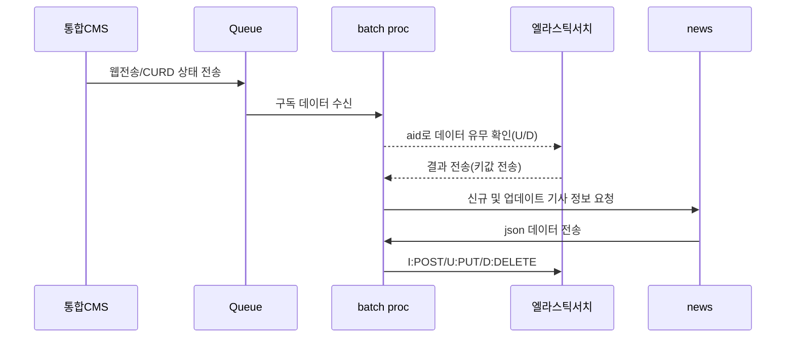
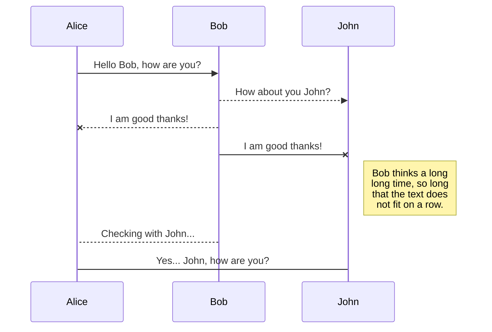
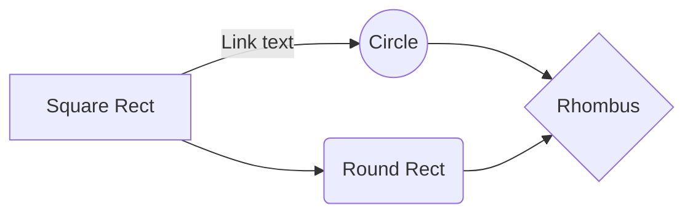

# cache 시스템 구축  
> 참고 자료 [엘라스틱서치 가이드](https://esbook.kimjmin.net/)
> 참고 자료 2 [엘라스틱서치 구성](https://soyoung-new-challenge.tistory.com/56)
## 1. 시스템 구축 계요  
한경닷컴의 뉴스 시스템은 파일과 검색엔진을 기반으로 서비스를 하고 있다.  
이에 따라 검색엔진에 문제가 발생하는 경우 서비스가 원할하지 않을 수 있다.  
또한 파일을 읽어 처리하기 때문에 많은 io가 발생시 시스템에 영향을 준다.  
io 비용을 줄이기 위한 방안으로 cache시스템을 구축 하고자 한다.   
  
## 2. 구축 검토
### 1. 워크 프로세스

### 2. 구성
	1.엘라스틱 서치 구성[마스터(2) & 데이터 노드(2) 구조]
	- 데이터 노느를 늘리는 경우 성능이 낮은 상태로 여러대 구성이 좋음
	- 클러스터는 아래 구성이 하나의 클러스터
|                |구성                          |제원(사용률에 따른 변경)|
|----------------|-------------------------------|-----------------------------|
|1.서버          |`마스터 노드 + 키바나`           |4vCpu X 16Gib            |
|2.서버          |`마스터 노드 + 데이터 노드`       |4vCpu X 16Gib            |
|3.서버          |`데이터 노드`                    |4vCpu X 16Gib|
	2.큐 및 배치 처리 
	- 큐는 CMS에서 상태를 저장 해놓는 방식이다. 그것이 MQ이던지 아니면 파일이던지 상관은 없다
	- 배치는 큐 또는 파일을 읽어 그 상태에 따른 행동을 취한다.
	- 기사 정보를 뉴스 서버에서 가져와 엘라스틱 서버로 전송(CRUD)을 한다.
	- 큐와 배치는 한대 서버에서 모두 동작이 가능 하다(비트코인 데이터 수신 서버 활용?)
|                |구성                          |제원(사용률에 따른 변경)|
|----------------|-------------------------------|-----------------------------|
|1.서버          |`ZMQ(queue) & python(batch) 연동` |4vCpu X 16Gib            |

### 3. 요구사항

엘라스틱 서버에 검색 또는 캐시기능으로 사용하기 위해  **메타정의**가 필요하다. 메타를 기준으로 서비스를 어떻게 활용하는지가 결정된다. 즉 현재 서비스를 어떻게 활용할 것인가에서 부터 시작 해서 메타야 한다.

> **ProTip:** 현재 서비스 기준으로 어떤것이 필요한지 **메타**를 정의 해야 한다. 
> 검색이 필요한 것인지 / 리스트가 필요한 것인지 / 범위는 어느 한정으로 할 것인지 등..
> 인풋 조건이 필요하며, 우리가 원하는 아웃풋도 정의도 필요

# Welcome to StackEdit!

Hi! I'm your first Markdown file in **StackEdit**. If you want to learn about StackEdit, you can read me. If you want to play with Markdown, you can edit me. Once you have finished with me, you can create new files by opening the **file explorer** on the left corner of the navigation bar.

# Files

StackEdit stores your files in your browser, which means all your files are automatically saved locally and are accessible **offline!**

## Create files and folders

The file explorer is accessible using the button in left corner of the navigation bar. You can create a new file by clicking the **New file** button in the file explorer. You can also create folders by clicking the **New folder** button.

## Switch to another file

All your files and folders are presented as a tree in the file explorer. You can switch from one to another by clicking a file in the tree.

## Rename a file

You can rename the current file by clicking the file name in the navigation bar or by clicking the **Rename** button in the file explorer.

## Delete a file

You can delete the current file by clicking the **Remove** button in the file explorer. The file will be moved into the **Trash** folder and automatically deleted after 7 days of inactivity.

## Export a file

You can export the current file by clicking **Export to disk** in the menu. You can choose to export the file as plain Markdown, as HTML using a Handlebars template or as a PDF.

# Synchronization

Synchronization is one of the biggest features of StackEdit. It enables you to synchronize any file in your workspace with other files stored in your **Google Drive**, your **Dropbox** and your **GitHub** accounts. This allows you to keep writing on other devices, collaborate with people you share the file with, integrate easily into your workflow... The synchronization mechanism takes place every minute in the background, downloading, merging, and uploading file modifications.

There are two types of synchronization and they can complement each other:

- The workspace synchronization will sync all your files, folders and settings automatically. This will allow you to fetch your workspace on any other device.
	> To start syncing your workspace, just sign in with Google in the menu.

- The file synchronization will keep one file of the workspace synced with one or multiple files in **Google Drive**, **Dropbox** or **GitHub**.
	> Before starting to sync files, you must link an account in the **Synchronize** sub-menu.

## Open a file

You can open a file from **Google Drive**, **Dropbox** or **GitHub** by opening the **Synchronize** sub-menu and clicking **Open from**. Once opened in the workspace, any modification in the file will be automatically synced.

## Save a file

You can save any file of the workspace to **Google Drive**, **Dropbox** or **GitHub** by opening the **Synchronize** sub-menu and clicking **Save on**. Even if a file in the workspace is already synced, you can save it to another location. StackEdit can sync one file with multiple locations and accounts.

## Synchronize a file

Once your file is linked to a synchronized location, StackEdit will periodically synchronize it by downloading/uploading any modification. A merge will be performed if necessary and conflicts will be resolved.

If you just have modified your file and you want to force syncing, click the **Synchronize now** button in the navigation bar.

> **Note:** The **Synchronize now** button is disabled if you have no file to synchronize.

## Manage file synchronization

Since one file can be synced with multiple locations, you can list and manage synchronized locations by clicking **File synchronization** in the **Synchronize** sub-menu. This allows you to list and remove synchronized locations that are linked to your file.

# Publication

Publishing in StackEdit makes it simple for you to publish online your files. Once you're happy with a file, you can publish it to different hosting platforms like **Blogger**, **Dropbox**, **Gist**, **GitHub**, **Google Drive**, **WordPress** and **Zendesk**. With [Handlebars templates](http://handlebarsjs.com/), you have full control over what you export.

> Before starting to publish, you must link an account in the **Publish** sub-menu.

## Publish a File

You can publish your file by opening the **Publish** sub-menu and by clicking **Publish to**. For some locations, you can choose between the following formats:

- Markdown: publish the Markdown text on a website that can interpret it (**GitHub** for instance),
- HTML: publish the file converted to HTML via a Handlebars template (on a blog for example).

## Update a publication

After publishing, StackEdit keeps your file linked to that publication which makes it easy for you to re-publish it. Once you have modified your file and you want to update your publication, click on the **Publish now** button in the navigation bar.

> **Note:** The **Publish now** button is disabled if your file has not been published yet.

## Manage file publication

Since one file can be published to multiple locations, you can list and manage publish locations by clicking **File publication** in the **Publish** sub-menu. This allows you to list and remove publication locations that are linked to your file.

# Markdown extensions

StackEdit extends the standard Markdown syntax by adding extra **Markdown extensions**, providing you with some nice features.

> **ProTip:** You can disable any **Markdown extension** in the **File properties** dialog.

## SmartyPants

SmartyPants converts ASCII punctuation characters into "smart" typographic punctuation HTML entities. For example:

|                |ASCII                          |HTML                         |
|----------------|-------------------------------|-----------------------------|
|Single backticks|`'Isn't this fun?'`            |'Isn't this fun?'            |
|Quotes          |`"Isn't this fun?"`            |"Isn't this fun?"            |
|Dashes          |`-- is en-dash, --- is em-dash`|-- is en-dash, --- is em-dash|

## KaTeX

You can render LaTeX mathematical expressions using [KaTeX](https://khan.github.io/KaTeX/):

The *Gamma function* satisfying $\Gamma(n) = (n-1)!\quad\forall n\in\mathbb N$ is via the Euler integral

$$
\Gamma(z) = \int_0^\infty t^{z-1}e^{-t}dt\,.
$$

> You can find more information about **LaTeX** mathematical expressions [here](http://meta.math.stackexchange.com/questions/5020/mathjax-basic-tutorial-and-quick-reference).

## UML diagrams

You can render UML diagrams using [Mermaid](https://mermaidjs.github.io/). For example, this will produce a sequence diagram:

And this will produce a flow chart:

